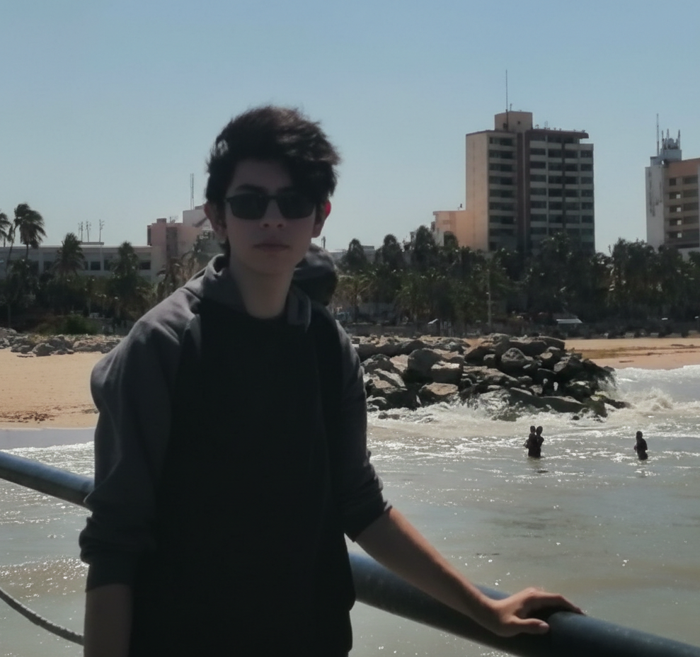
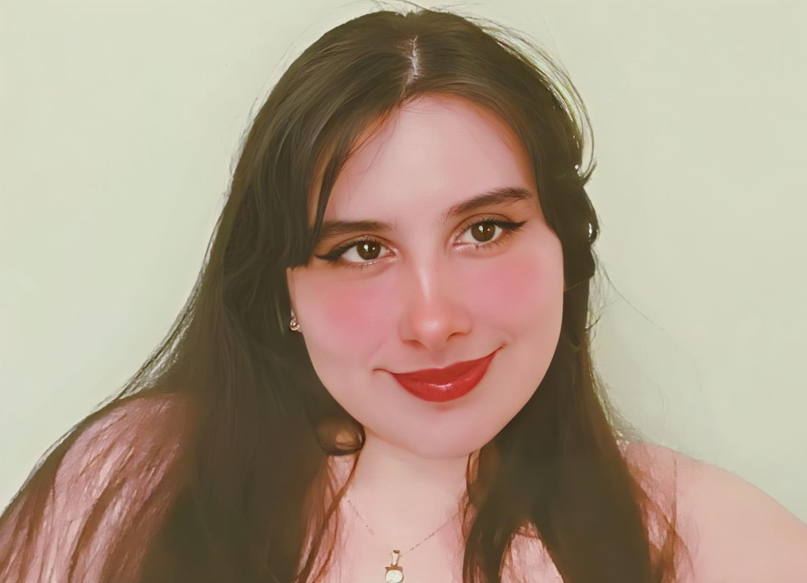
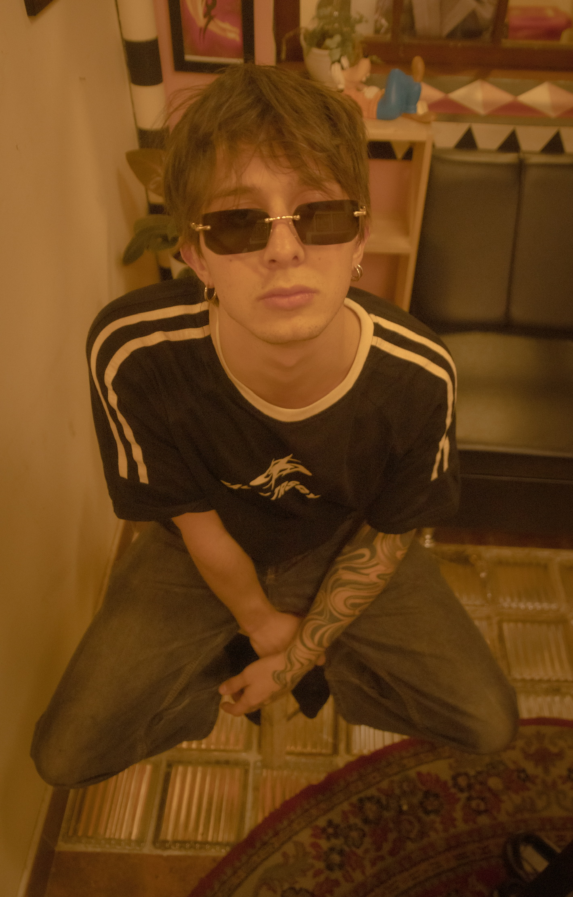

# Juan Guillermo Piñerez Marín

*Rol en la industria:* Desarrollo de Videojuegos  
*Ubicación:* Colombia  

## Perfil

Soy estudiante de Ingeniería Multimedia, apasionado por los videojuegos y el dibujo.  
Me considero una persona responsable, comprometido y con buena disposición para el trabajo en equipo.

# Yemmie Nayarit Duarte Sánchez

*Rol en la industria:* Narrative Designer y Game Audio 
*Ubicación:* Colombia

## Perfil

Soy una estudiante de Ingeniería Multimedia, me encanta todo lo que tenga que ver con multimedia, desde videos juegos, hasta recursos audio visuales, entre otros. Soy una persona divertida y se trabajar sola y en equipo.

# Daniel Ricardo Guerrero Zuluaga

*Rol en la industria:* Artista gráfico 
*Ubicación:* Colombia

## Perfil

Soy Daniel Guerrero, tengo 25 años, soy estudiante en Ingeniería Multimedia, actualmente laboro como Visual Designer y fotógrafo independiente.
Soy amante a la música, pintura y las expresiones del arte.
